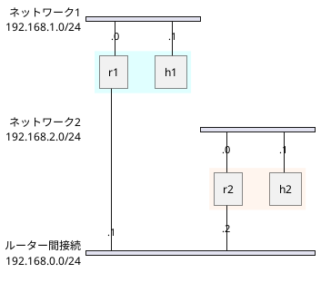
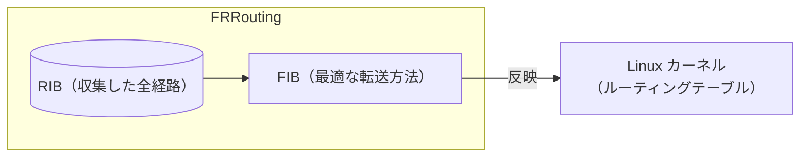

# インターネットのしくみを知る
## セキュリティ・キャンプ2026ミニ（北海道開催） 事前講義

---


<p id="hello-world">リンク先</p>

---
routeAlias: alias
---

<a href="#hello-world">リンクです</a>


---

<Link to="3">3ページ目へ</Link>
<Link to="alias">エイリアスへ</Link>

---

# 事前講義の意図
当日に行う講義では、DDoS 攻撃やその周辺知識について、<br>詳しい解説を行います。

この事前講義では、当日の講義の前提となる基礎知識を学習します。

---
layout: center
---

# インターネットとは

ネットワークどうしが（国際的に）接続したもの。
### 『ネットワークのネットワーク』ですね！

---

# IP（Internet Protocol）
インターネットでは、
**IP**（Internet Protocol）という取り決めのもとで<br>
データをやりとりします。

---
routeAlias: ip-address
---

# IP パケットと IP アドレス
- IP では、データを「パケット」に分けて送ります。
- パケットには送信元/送信先のコンピュータを識別するための<br>
  「IPアドレス」という 8x4=32 ビットの値も書き込まれています。<br>

---
routeAlias: nexthop
---

# どのように転送するのか
世界各地のルーターが、パケットをリレー式に伝えることで、<br>
送信先にたどりつきます。

ルーターがパケットを転送する次経由地を「ネクストホップ」とよびます。

---
routeAlias: routing
---

# ルーティング
ルーターは、さまざまなルーターと接続しています。

そのなかから適切な<Link to="nexthop">ネクストホップ</Link>を選ぶことを、<br>
「ルーティング」といいます。

---

# ルーティングテーブル
『どのサブネット（後述）へのパケットをどの<Link to="nexthop">ネクストホップ</Link>に転送するか』<br>
という条件をまとめたものを「ルーティングテーブル」とよびます。

ルーターは、「ルーティングテーブル」をもとに<Link to="routing">ルーティング</Link>を行います。

---

# IP アドレスとサブネット
ルーティングテーブルでは、複数の<Link to="ip-address">IP アドレス</Link>を<br>「サブネット」でまとめて管理します。

サブネットは、たとえば次のように表記します。
>192.168.0.0/16

このサブネットは、`192.168.0.0`～`192.168.255.255`の範囲を表します。

---

# 演習: ルーティングテーブルの読み方
ルーターが、次のルーティングテーブルをもっているとします。

---

# 演習: ルーティングテーブルの手動設定
コンテナを用いた仮想ネットワーク「Containerlab」を使って、<br>ルーティングを手動設定してみましょう。

手動設定したルーティングテーブルのことを、後述する自動設定と比較して、<br>「Static Routing」と呼びます。

まずは、GitHub Codespaces を作成します。

---

### ネットワーク構成の確認
`bgp.yaml`ファイルを開いてください。

演習で使用する Docker コンテナが定義されています。

- ルーター（routers）: `r1`, `r2`
  - `frrouting`（ソフトウェアルーター）を使用
- 一般ホスト（hosts）: `h1`, `h2`
  - `netshoot`（ネットワークトラブルシューティング用イメージ）を使用

---
layout: two-cols-header
---

::left::
### 演習の目標
`h1`と`h2`間で通信ができるように<br>
しましょう。
 
図のとおり、`h1`と`h2`は直接接続<br>
されて**いません**。

`r1`と`r2`にルーティング設定を行って、<br>
パケットを適切に転送させる必要が<br>
あります。

::right::



---
layout: image-right
image: ./images/containerlab-extension.png
---

### Containerlab 画面を開く
Codespace 画面の左側にある<br>
Containerlab のボタンを<br>
クリックしてください。

---

### ネットワークを作成する

---
layout: image-right
routeAlias: connect-to-h1
---

### h1 コンテナに接続する

1. Containerlab 画面で、<br>
  コンテナ名を右クリック<br>
  します。
2. 「Access」でホバーします。
3. 「Attach Shells」を<br>
   クリックします。
4. ターミナルタブに、`h1`を<br>
  操作するためのシェルが<br>
  開かれます。

---
routeAlias: traceroute
---

### h1 から h2 への経路を調べる
`h1`と`h2`には、`mtr`というツールがインストールされています。

<p><Link to="connect-to-h1">先ほど開いた h1 操作用のシェル</Link>で、次のように実行します。</p>

```sh
mtr 192.168.2.1
```

パケットが転送された経路がリストアップされます。<br>
デフォルトゲートウェイ（h1 から r1への転送）の設定は、講師が事前に行いました。

---
routeAlias: operate-r1
---

### r1 に接続して FRRouting を操作する

<p><Link to="connect-to-h1">h1 に接続したとき</Link>と同じ要領で、r1 操作用のシェルを開いてください。</p>

`vtysh`を実行して FRRouting コマンドを実行できるようにします。
```sh [Linux コマンド受付状態で]
vtysh
```

<br>

⚠️**シェルの出力の行頭に注意してください。**
- `/ #`: Linux コマンドを受け付けています。
- `r1#`: vtysh 実行中。FRRouting コマンドを受け付けています。

---
routeAlias: exit-vtysh
---

### 補足: vtysh の終了

vtysh を終了するには、`exit`コマンドを使用します。
```sh [vtysh 実行状態で]
exit
```

出力の行頭を確認してください。

`/ #`などの場合、終了が成功し、Linuxコマンド受付状態になっています。

---

### FRRouting の RIB を確認する

⚠️**前提条件**

r1 シェルを開いており、<Link to="operate-r1">FRRouting コマンド受付状態になっている</Link>。

<br>

FRRouting が保持している経路情報（Route Information Base, **RIB**）を<br>
確認しましょう。
```sh [vtysh 実行状態で]
show ip route 
```

---

### RIB とルーティングテーブル

FRRouting の RIB は、ルーティングテーブルを計算するための元データです。

パケット転送で実際に使用されるルーティングテーブルは、Linuxカーネルが<br>保持します。

FRRouting は、RIB をもとに「FIB」という転送ルールを計算し、<br>Linux カーネルのルーティングテーブルに反映します。



---

### Linux カーネルのルーティングテーブルを確認する 

⚠️**前提条件**
<ul>
    <li>r1 のシェルを開いている（参考: <Link to="connect-to-h1">h1のシェルを開いたとき</Link>）。</li>
    <li>Linux コマンド受付状態になっている（参考: <Link to="exit-vtysh">vtysh を終了</Link>）。</li>
</ul>

<br>

次のコマンドを実行すると、Linux カーネルに保持されている<br>ルーティングテーブルが表示されます。
```sh [Linux コマンド受付状態で]
ip route list
```

---

### FRRouting の設定を確認する

`r1`と`r2`の設定は、それぞれ`r1.conf`と`r2.conf`ファイルにあります。
```sh [r1.conf]
# ネットワークインターフェース eth1 に対する設定
interface eth1
    # インターフェースの説明
    description "To h1"
    # インターフェースの IP アドレス設定
    ip address 192.168.1.0/24
```

---

### Static Routing を設定する
特定のサブネットを宛先とするパケットを、どのネクストホップに転送させるか設定したいとします。

`r1.conf`などの設定ファイルに、次の形式の行を加えます。

```sh [r1.conf]
ip route サブネット ネクストホップのIPアドレス
```

---
routeAlias: static-routing-example
---

### Static Routing を設定する（例）

r1 は、サブネット`192.168.2.0`（ネットワーク2）に対するパケットを、`192.168.0.2`（r2）に転送する必要があります。

この場合は、次のように記述します。
```sh [r1.conf]
ip route 192.168.2.0/24 192.168.0.2
```

---

### 課題1: h1 のパケット転送経路の確認

ここまでの手順で、r1 に対する設定は完了しているはずです。
<p>
<Link to="traceroute">mtr の使用法</Link>を参考に、h1が送信したパケットがどこまで到達しているかを確認してください。
</p>

<br>

### 課題2: r2 への設定

<p>
<Link to="static-routing-example">r1 の設定</Link>を参考に、r2 にも設定を行ってください。
</p>

- Hint: どのサブネットを宛先とするパケットを、どのネクストホップに転送すればよいでしょうか？

---

### 補足

- 課題が終わったら、FRRouting のその他の機能を触ってみてください。
  - https://docs.frrouting.org/en/latest/basics.html

  - FRRouting コマンドは、Cisco IOS に似た文法です。
- `write memory`については、マウント元の`r1.conf`ファイルの権限を変更してしまうため実行しないでください。

---
layout: section
---

# BGP によるルーティング

---
routeAlias: routing-protocol
---
# ルーティングプロトコル
ルーティングテーブルを構築するのに必要な情報を「経路情報」とよび、<br>
「ルーティングプロトコル」によってやり取りされます。

---

# BGP（Border Gateway Protocol）
ルーティングプロトコルにはさまざまな種類がありますが、<br>
インターネット上でのルーティングに広く用いられるのがBGPです。

---
routeAlias: as
---

# 自律システム
BGP では、独立したネットワークを「自律システム」<br>
（Autonomous System, AS）とよびます。

インターネットは、自律システムどうしのネットワークといえます。

BGP で、自律システムどうしが経路情報を交換しあうことで、<br>
ルーターはルーティングテーブルを動的に導出できます。

---

# 演習: 自律システム

[bgp.tools](https://bgp.tools) を使って、好きな自律システムを調べてみてください。

自律システムは、インターネットサービスプロバイダやコンテンツ事業者など、さまざまな組織に割り当てられています。

- 自律システムに割り振られた「AS番号（ASN）」はなんですか？<br>（例: AS12345）
- 自律システムにはどのようなIPサブネットが割り当てられていますか？

---

# 演習: BGP
BGP がどのように<Link to="routing-protocol">経路情報</Link>を交換しているのかを確認しましょう。

この演習でも、引き続き Containerlab を使用して演習を行います。

---

### BGP 用の設定