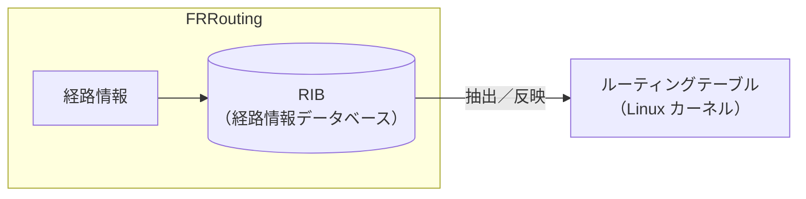

# インターネットのしくみを知る
## セキュリティ・キャンプ2026ミニ（北海道開催） 事前講義

---

# 事前講義の意図
当日に行う講義では、DDoS 攻撃やその周辺知識について、<br>詳しい解説を行います。

この事前講義では、当日の講義の前提となる基礎知識を学習します。

---
layout: center
---

# インターネットとは

ネットワークどうしが（国際的に）接続したもの。
### 『ネットワークのネットワーク』ですね！

---

# IP（Internet Protocol）
インターネットでは、
**IP**（Internet Protocol）という取り決めのもとで<br>
データをやりとりします。

---
routeAlias: ip-address
---

# IP パケットと IP アドレス
- IP では、データを「パケット」に分けて送ります。
- パケットには送信元/送信先のコンピュータを識別するための<br>
  「IPアドレス」という 8x4=32 ビットの値も書き込まれています。<br>

---
routeAlias: nexthop
---

# どのように転送するのか
世界各地のルーターが、パケットをリレー式に伝えることで、<br>
送信先にたどりつきます。

ルーターがパケットを転送する次経由地を「ネクストホップ」とよびます。

---
routeAlias: routing
---

# ルーティング
ルーターは、さまざまなルーターと接続しています。

そのなかから適切な<Link to="nexthop">ネクストホップ</Link>を選ぶことを、<br>
「ルーティング」といいます。

---

# 演習: ルーティングテーブルの手動設定
コンテナを用いた仮想ネットワーク「Containerlab」を使って、<br>ルーティングを手動設定してみましょう。

手動設定したルーティングテーブルのことを、後述する自動設定と比較して、<br>「Static Routing」と呼びます。

---
layout: two-cols-header
---

### GitHub Codespaces の作成
この演習では、GitHub Codespaces を使って演習環境を構築します。

::left::
1. GitHub にログインします。
2.  [リンク](https://github.com/codespaces/new?hide_repo_select=true&repo=1351211162&skip_quickstart=true&ref=main)をクリックします。
  Codespaces 作成画面 が開きます。
3. 「Create codespace」（右図）を<br>クリックします。 

::right::


---

### ネットワーク構成の確認
`labs/static-routing/static-routing.clab.yml`ファイルを開きます。

演習で使用する Docker コンテナが定義されています。

- ルーター（routers）: `r1`, `r2`
  - `frrouting`（ソフトウェアルーター）を使用
- 一般ホスト（hosts）: `h1`, `h2`
  - `netshoot`（ネットワークトラブルシューティング用イメージ）を使用

---
layout: two-cols-header
---

::left::
### 演習の目標
`h1`と`h2`間で通信ができるように<br>
しましょう。
 
図のとおり、`h1`と`h2`は直接接続<br>
されて**いません**。

`r1`と`r2`にルーティング設定を行って、<br>
パケットを適切に中継させる必要が<br>
あります。

::right::

<<< @/snippets/static-routing.plantuml

---
layout: two-cols-header
routeAlias: task1
---

### 課題1: パケットはどのように転送されるべきか

::left::

<v-clicks> 

- **Q1**: `h1`から`h2`宛のパケットは、<br>どのような経路で転送されるべき<br>でしょうか。
- **A1**: 図を順にたどれば、<br>`h1`→`r1`→`r2`→`h2`となります。

</v-clicks>

<br>

<v-clicks>

- **Q2**: `h2`から`h1`宛のパケットは、<br>どのような経路で転送されるべき<br>でしょうか。
- **A2**: `h2`→`r2`→`r1`→`h1`ですね。

</v-clicks>

::right::

<<< @/snippets/static-routing.plantuml


---
layout: two-cols-header
routeAlias: redeploy
---

### ネットワークを作成する (1)

::left::

`static-routing.clab.yml`ファイルを<br>右クリックし、「Redeploy」を<br>クリックします。

コンテナと仮想ネットワークの作成が<br>始まります。

::right::


---

### ネットワークを作成する (2)

ネットワークの作成が完了すると、画面右下に図の通知が表示されます。


---

### コンテナのシェルを開く (1)

コンテナ上でコマンドを実行するために、「シェル」を開く方法を説明します。

まず Codespaces 画面で `Ctrl` `Shift` `@` を同時に押すと、<br>新規のターミナルが作成されます。

次のコマンドで Docker を CLI で管理する `lazydocker` を起動します。

```sh
lazydocker
```

---
layout: two-cols-header
routeAlias: connect-to-h1
---

### コンテナのシェルを開く (2)

::left::

`lazydocker`の画面では、Containers<br> 
という枠の中にコンテナの一覧が表示<br>されます。


**💡例: `h1` に接続したいとき**
1. `clab-bgp-basic-h1`をクリック。
2. `Shift` `E` を同時に押します。<br>内部で `docker exec` が発行され、<br>シェルが開きます。

シェルは`Ctrl` `D`で閉じられます。

::right::


---

### ルーティングテーブル
『どのサブネット（後述）へのパケットをどの<Link to="nexthop">ネクストホップ</Link>に転送するか』<br>
という条件をまとめたものを「ルーティングテーブル」とよびます。

ルーターは、「ルーティングテーブル」をもとに<Link to="routing">ルーティング</Link>を行います。

---
routeAlias: subnet
---

### サブネット
ルーティングテーブルでは、複数の<Link to="ip-address">IP アドレス</Link>を「サブネット」で<br>まとめて管理します。

サブネットは、たとえば次のように表記します。
```
192.168.0.0/16
```

32ビットあるIPアドレスのうち、16ビット（`/16`）まで<br>`192.168.0.0`と合致する IP アドレスがこのサブネットに含まれます。

つまり、このサブネットは`192.168.0.0`～`192.168.255.255`を表します。

---
routeAlias: routing-table
---

### ルーティングテーブルを確認する (1)

**前提条件**: <Link to="connect-to-h1">特定のコンテナのシェルを開いている</Link>

次のコマンドで、コンテナで使われているルーティングテーブルを確認します。

```sh
ip route list
```

次のように出力されます。

```sh
default via 172.20.20.1 dev eth0 # 管理用ネットワーク 
172.20.20.0/24 dev eth0 proto kernel scope link src 172.20.20.5 # 管理用
192.168.0.0/16 via 192.168.1.1 dev eth1
192.168.1.0/24 dev eth1 proto kernel scope link src 192.168.1.2 # 直接接続先
```

---
routeAlias: routing-table-mean
---

### ルーティングテーブルを確認する (2)

次の行を例に、読み方を説明します。

```sh
192.168.0.0/16 via 192.168.1.1 dev eth1
```
- サブネット`192.168.0.0/16`を宛先とするパケットを
- ネクストホップ`192.168.1.1`に`eth1`インターフェースから転送する

<br>

💡たとえば、`192.168.2.2`を宛先として`h1`からパケットを送るとき、<br>
ネクストホップ`192.168.1.1`に転送されるということですね。

<br>

**注意**:  `172.20.20.0/24`は管理用サブネットのため、今回は無視します。

---
routeAlias: traceroute
---

### h1 から h2 への経路を調べる (1)

**前提条件**: <Link to="connect-to-h1">h1またはh2コンテナのシェルを開いている</Link>

`h1`と`h2`には、`mtr`というツールがインストールされています。

特定の IP アドレスへの疎通有無や通信経路などを調べられます。

```sh
mtr 192.168.2.2
```

`mtr` の実行を停止したいときは、`Q`キーを押してください。

---

### h1 から h2 への経路を調べる (2)

**例**


- 💡 <Link to="routing-table-mean">ルーティングテーブル</Link>に従って、`192.168.2.2`（`h2`）宛のパケットが<br>
`192.168.1.1`（`r1`）に転送されていることがわかります。

- 😞 `h1`→`r1` までは転送されていますが、`r2`には転送されていません。<br>そのため`h2`にパケットが届きません。

---
routeAlias: task2
---

### 課題2: あるべき姿と現状の違いを調べる

1. <Link to="traceroute">mtr</Link> を使って、現在のパケット転送の状態を調べましょう。
2. <Link to="task1">課題1</Link>で考えた「あるべき姿」との違いを考えましょう。

<br>

<v-clicks depth="2">

- **Q1**: `h1`から`h2`宛のパケット
  - あるべき姿: `h1`→`r1`→`r2`→`h2`
  - 現在: `h1`→`r1`まで （`r1`から`r2`への転送ができていない）
- **Q2**: `h2`から`h1`宛のパケット
  - あるべき姿: `h2`→`r2`→`r1`→`h1`
  - 現在: `h2`→`r2`まで　（`r2`から`r1`への転送ができていない）

</v-clicks>


---
layout: center
---

### ルーターの設定を変更して
### あるべき姿とのずれを解消しよう

---
routeAlias: operate-r1
---

### r1 に接続して FRRouting を操作する

**前提条件**: <Link to="connect-to-h1">r1 または r2 コンテナのシェルを開いている</Link>

`vtysh`を実行して FRRouting コマンドを実行できるようにします。
```sh 
# Linux コマンド受付状態で
vtysh
```

<br>

⚠️**シェルの出力の行頭に注意してください。**
- `/ #`: Linux コマンドを受け付けています。
- `r1#`: vtysh 実行中。FRRouting コマンドを受け付けています。

---
routeAlias: exit-vtysh
---

### 補足: vtysh の終了

vtysh を終了するには、`exit`コマンドを使用します。
```sh 
# vtysh 実行状態で
exit
```

出力の行頭を確認してください。
- `/ #`などの場合、終了が成功し、Linuxコマンド受付状態になっています。
- それ以外の場合、終了に失敗しています。

---

### RIB とルーティングテーブル

FRRouting などのソフトウェアルーターは、<br>
Linux カーネルが保持する<Link to="routing-table">ルーティングテーブル</Link>を自動的に作るために<br>
**RIB**（Routing Information Base）という経路情報のデータベースを持ちます。

ソフトウェアルーターは、RIB から最適な経路を抽出し、<br>Linux カーネルのルーティングテーブル（FIB）に反映します。



---
routeAlias: show-rib
---

### FRRouting の RIB を確認する (1)

️**前提条件**:
- r1 または r2 のシェルを開いている。
- かつ、<Link to="operate-r1">FRRouting コマンド受付状態になっている</Link>。


FRRouting（ルーター）が保持している RIB（経路情報）を確認しましょう。
```sh 
# vtysh 実行状態で
show ip route 
```

---

### FRRouting の RIB を確認する (2)

たとえば、次のように出力されます。

```sh
IPv4 unicast VRF default:
K>* 0.0.0.0/0 [0/0] via 172.20.20.1, eth0, weight 1, 02:54:06
C>* 10.0.0.0/24 is directly connected, eth-r2, weight 1, 02:54:05 # r2へ
L>* 10.0.0.1/32 is directly connected, eth-r2, weight 1, 02:54:05 # r2へ
C>* 172.20.20.0/24 is directly connected, eth0, weight 1, 02:54:06 # 管理用
L>* 172.20.20.4/32 is directly connected, eth0, weight 1, 02:54:06 # 管理用
C>* 192.168.1.0/24 is directly connected, eth-h1, weight 1, 02:54:05 # h1へ 
L>* 192.168.1.1/32 is directly connected, eth-h1, weight 1, 02:54:05 # h1へ
```

- `C`, `L`: 直接接続しているホスト、サブネットへの経路を表します。
- `*`: その経路が FIB に含まれている<br>（= カーネルのルーティングテーブルに反映されている）ことを示します。

---

### FRRouting の設定を確認する

`r1`と`r2`の設定は、それぞれ`r1.conf`と`r2.conf`ファイルにあります。

初期状態では、もう一方のルーターと、一般ホストへのインターフェースの IP アドレスが設定されています。

```sh [r1.conf]
# ネットワークインターフェース eth-r2 に対する設定
interface eth-r2
    # インターフェースに IP アドレスを割り当てる
    ip address 10.0.0.1/24

# ...
```

---

### 課題3: ネクストホップを設定する (1)

💡<Link to="task2">課題2</Link>でみた、`h2`宛のパケットを`r1`が`r2`しない問題を解決します。

そのためには `h2`宛パケットのネクストホップを`r2`にする必要があります。

<br>

ネクストホップを設定するには、`r1.conf`などの設定ファイルに、次の形式の行を加えます。

```sh [r1.conf]
ip route サブネット ネクストホップのIPアドレス
```

---
routeAlias: task3
---

### 課題3: ネクストホップを設定する (2)

サブネット`192.168.2.0/24`（ネットワーク2）宛のパケットを、<br>
ネクストホップ`10.0.0.2`（`r2`）に転送する場合、次のようにします。

```sh
ip route 192.168.2.0/24 10.0.0.2
```

<br>

💡同様に、`r2`が`h1`宛のパケットを`r1`に転送しない問題を解決しましょう！

⚠️Hint: `r2`の設定ファイルは`r2.conf`です。

<v-click>

```sh
ip route 192.168.1.0/24 10.0.0.1
```
</v-click>

---

### 課題4: h1 と h2 の疎通を確認する

1. <Link to="redeploy">Redeploy</Link>を実行してコンテナを作り直します。<br>これにより、設定ファイルの変更が反映されます。
2. `h1`から`h2`に<Link to="traceroute">mtr</Link>を実行します。<br>`192.168.2.2`が表示され、`Loss`は0.0%になっていることを確認します。
   
3. `h2`から`h1`にも`mtr`を実行します。<br>`192.168.1.2`が表示されていれば通信に成功しています。

---

### 追加課題: RIB の変化を確認する

余裕があれば、`r1`と`r2`の<Link to="show-rib">RIBを確認</Link>してみましょう。

```diff
# show ip route を r1 で実行した場合
  ...
  C>* 192.168.1.0/24 is directly connected, eth-h1, weight 1, 00:11:11
  L>* 192.168.1.1/32 is directly connected, eth-h1, weight 1, 00:11:11
+ S>* 192.168.2.0/24 [1/0] via 10.0.0.2, eth-r2, weight 1, 00:11:11
```

<br>

💡`S`と付記された経路が増えています！

`192.168.2.0/24`宛のパケットを`10.0.0.2`に転送させる経路です。<br>
→　<Link to="task3">課題3</Link>で追加した経路ですね。

---

### 追加課題: FRRouting の機能を調べる 

- 課題が終わったら、FRRouting のその他の機能を調べてみてください。
  - https://docs.frrouting.org/en/latest/basics.html

  - FRRouting コマンドは、Cisco IOS に似た文法です。
- `write memory`については、マウント元の`r1.conf`ファイルの権限を変更してしまうため実行しないでください。

---
layout: section
---

# BGP によるルーティング

---
layout: center
---

## 😞 Static Routing でインターネットの<br>大規模なルーティングをするのは難しい

全世界のネットワークへの経路（フルルート）は数が多すぎる<br>
※ 2026年時点で100万経路程度

各地でルーターの故障が起こりうる

---
routeAlias: routing-protocol
---
# ルーティングプロトコル
💡インターネットでは、ルーターどうしで自動的にルーティングを行います。

「ルーティングプロトコル」という取り決めのもとで**経路情報をやり取り**し、<br>
ルーターの故障があっても**迂回経路が自動的に選択**されます。

---

# BGP（Border Gateway Protocol）
ルーティングプロトコルにはさまざまな種類がありますが、<br>
インターネット上でのルーティングには「BGP」を用います。

---
routeAlias: as
---

# 自律システム
BGP では、独立した運用ポリシーをもつネットワークを「自律システム」<br>
（Autonomous System, **AS**）とよびます。

AS には番号が紐づけられます。ISP（インターネットサービスプロバイダ）<br>
などの組織がAS番号の割り当てを受け、ASを運用しています。

つまり、**インターネットは AS どうしが BGP で接続されたネットワーク**です。

---
 
# 演習: 自律システム

[bgp.tools](https://bgp.tools) を使って、好きな自律システムを調べてみてください。

自律システムは、インターネットサービスプロバイダやコンテンツ事業者など、さまざまな組織に割り当てられています。

- 自律システムに割り振られた「AS番号（ASN）」はなんですか？<br>（例: AS12345）
- 自律システムにはどのようなIPプレフィックス（サブネット）が割り当てられていますか？

---

# 演習: BGP（基本編）
ルーター上で BGP を動作させて、どのように<Link to="routing-protocol">経路情報を交換</Link>しているのかを<br>
確認しましょう。

この演習でも、引き続き Containerlab を使用して演習を行います。

まずは`labs/bgp-basic/bgp-basic.clab.yml`を<Link to="redeploy">Redeploy</Link>してください。


---
layout: two-cols-header
---

### ネットワーク構成を確認する

::left::

この演習では、Static Routing と同様のネットワーク構成を使用します。

`r1`と`r2`の間で経路情報を交換し、<br>
`h1`と`h2`を疎通させましょう。

::right::

<<< @/snippets/static-routing.plantuml

---

### 課題1: AS番号の設定 (1)

BGP では、ルーターは自身のAS番号を通信相手に知らせます。<br>
今回は、`r1`がAS65001、`r2`がAS65002にそれぞれ含まれているとします。

`r1.conf`に次のように追記します。

```sh
# すでにある IP アドレス設定
interface ...

# BGP 設定用ブロック 
router bgp 65001
  # BGP を動作させるインターフェースの IP アドレス
  bgp router-id 10.0.0.1
  # Import Policy の無効化（非推奨！本演習のみの設定）
  no bgp ebgp-requires-policy
```

---

### 課題1: AS番号の設定 (2)

次のことに注意して、`r2.conf`にも設定を追加します。
- `r2`のAS番号は65002
- BGPに使用するインターフェースは`10.0.0.2`

実装したら、`sample/r2.conf`を参照して正誤を確認してください。

---

### 課題2: ネイバーの設定

BGP の通信を確立するには、ネイバーの IP アドレスの登録が必要です。<br>
※ BGP の通信相手のことをネイバー（ピア）と呼びます。

```sh [r1.conf]
  bgp router-id 10.0.0.1 # すでにある設定
  neighbor 10.0.0.2 remote-as 65002 # 追記
```

`r2`にも実装し、`sample/r2.conf`を参照して正誤を確認してください。

---

### 追加課題: BGP セッション確立のようすを調べる

Containerlab では、Edgeshark を使ったパケットキャプチャが可能です。

---

### 課題3: 経路広報する Prefix の設定 (1)

ネイバーに広報（交換）するIP Prefix（サブネット）を設定します。

```sh [r1.conf]
  neighbor 10.0.0.2 remote-as 65002 # すにである設定

  # ここから追記
  address-family ipv4 unicast
    # 広報する Prefix の指定
    network 192.168.1.0/24
  exit-address-family
```

`r2`にも設定し、`sample/r2.conf`を参照して正誤を確認してください。

---

### 課題4: 疎通を確認する

`r1`と`r2`が経路を交換して、`h1`と`h2`が通信できるようになっているはずです。

1. `h1`から<Link to="mtr">mtr</Link>を使って、`h2`に通信できることを確認してください。
2. `h2`からも同様に`h1`に通信できることを確認してください。

---

### 追加課題: 経路広報のようすを調べる

---

### 追加課題: 受信した経路が RIB に登録されているか調べる

---
layout: section
---

# 経路フィルタと BGP Community

---

# 経路フィルタの重要性

これまでは、受信した経路はすべて保持してきました。<br>
また、持っている経路をネイバーにすべて広報していました。

しかし、一般的には、経路の送受信にフィルタをかけます。
- 例1: ネイバーからの不正な受信経路を取り除きたい
- 例2: 自ASからの誤った経路広報を防ぎたい
- 例3: 細かすぎる経路情報を除外したい
- 例4: トランジットからの受信経路をピアには知らせたくない

---

# 演習: 経路フィルタを設定する

---

# BGP Community で柔軟に経路制御する

経路フィルタなどの制御を柔軟に行うために、<br>
経路の送受信時に「BGP Community」というタグを付けられます。

Communityは4バイトで、`[12345:12345]`のように2バイトずつ表記します。

**できることの例**
- 特定の Community が付加された受信経路はネイバーに広報しない
- 特定の Community が付加された経路を優先する

---

# BGP Community の運用 

BGP Community の用途は、**基本的には**各 AS で規定されています。

**例**: NTT Global IP Network（AS2914）
- NTT が世界各国に提供している IP 通信サービスです。
- BGP Community の取り扱いを公開しています。<br>
  https://www.gin.ntt.net/support-center/policies-procedures/routing/

---

# Well-known Community

`1:0`～`65534:65535`のCommunityは、自由に用途を決められます。

いっぽう、`65535:0`～`65535:65535`は、あらかじめ用途が定められています。

このような Community を「Well-known Community」といいます。

<br>

**例**
- NO_ADVERTISE（`65535:65282`）
  - 経路を他のネイバーに広報させない
- **BLACKHOLE**（`65535:666`）
  - 特定の IP Prefix を宛先とするパケットをネイバーに破棄させる

---

# 演習: BGP Community 


